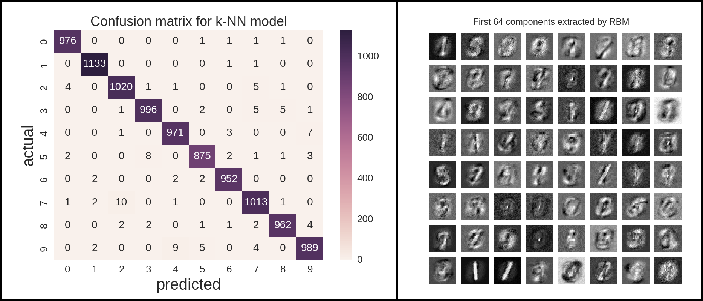

# ML MNIST Challenge
This contest was offered within TU Munich's course Machine Learning (IN2064).<br>
The goal was to implement k-NN, Neural Network, Logistic Regression and Gaussian Process Classifier in 
python from scratch and achieve minimal average test error among these classifiers on well-known MNIST dataset, 
without ensemble learning.

## Results
| Algorithm | <div align="center">Description</div> | Test Error, % |
| :---: | :--- | :---: |
| ***k-NN*** | 3-NN, Euclidean distance, uniform weights.<br/>*Preprocessing*: Feature vectors extracted from ***NN***. | **1.13** |
| ***k-NN<sub>2</sub>*** | 3-NN, Euclidean distance, uniform weights.<br/>*Preprocessing*: Augment (training) data (&#215;9) by using random rotations,<br/>shifts, Gaussian blur and dropout pixels; PCA-35 whitening and multiplying<br/>each feature vector by e<sup>11.6 &#183; ***s***</sup>, where ***s*** &ndash; normalized explained<br/>variance by the respective principal axis. (equivalent to applying PCA<br/>whitening with accordingly weighted Euclidean distance). | **2.06** |
| ***NN*** | MLP 784-1337-D(0.05)-911-D(0.1)-666-333-128-10 (D &ndash; dropout);<br/>hidden activations &ndash; LeakyReLU(0.01), output &ndash; softmax; loss &ndash; categorical<br/>cross-entropy; 1024 batches; 42 epochs; optimizer &ndash; *Adam* (learning rate<br/>5 &#183; 10<sup>&ndash;5</sup>, rest &ndash; defaults from paper).<br/>*Preprocessing*: Augment (training) data (&#215;5) by using random rotations,<br/> shifts, Gaussian blur. | **1.04** |
| ***LogReg*** | 32 batches; 91 epoch; L2-penalty, &#955; = 3.16 &#183; 10<sup>&ndash;4</sup>; optimizer &ndash; *Adam* (learning<br/>rate 10<sup>&ndash;3</sup>, rest &ndash; defaults from paper)<br/>*Preprocessing*: Feature vectors extracted from ***NN***. | **1.01** |
| ***GPC*** | 794 random data points were used for training; &#963;<sub>n</sub> = 0; RBF kernel (&#963;<sub>f</sub> = 0.4217,<br/>&#947; = 1/2l<sup>2</sup> = 0.0008511); Newton iterations for Laplace approximation till<br/>&#916;Log-Marginal-Likelihood &leq; 10<sup>&ndash;7</sup>; solve linear systems iteratively using CG with<br/> 10<sup>&ndash;7</sup> tolerance; for prediction generate 2000 samples for each test point.<br/>*Preprocessing*: Feature vectors extracted from ***NN***. | **1.59** |

## Visualizations

And more available in `experiments/plots/`.

## How to install
```bash
git clone https://github.com/monsta-hd/ml-mnist
cd ml-mnist/
sudo pip install -r requirements.txt
```
After installation, tests can be run with:
```bash
make test
```

## How to run
Check [main.py](main.py) to reproduce training and testing the final models.<br>
Check also [experiments notebook](https://nbviewer.jupyter.org/github/monsta-hd/ml-mnist/blob/master/experiments/cross_validations.ipynb) to see what I've tried.<br>

## Features
* Apart from specified algorithms, there are also PCA and RBM implementations
* Most of the classes contain doctests so they are easy to understand
* All randomness in algorithms or functions is reproducible (seeds)
* Support of simple readable serialization (JSON)
* There are also some infrastructure for model selection, feature selection, data augmentation, metrics, plots etc.)
* Support for ***MNIST*** or ***Fashion MNIST*** (both have the same structure thus both can be loaded using the [same routine](ml_mnist/utils/dataset.py))

## System
All computations and time measurements were made on laptop `i7-5500U CPU @ 2.40GHz x 4` `12GB RAM`

## Future work
Here the list of what can also be tried regarding these particular 4 ML algorithms (didn't have time to check it, or it was forbidden by the rules, e.g. ensemble learning):
* Model averaging for k-NN: train a group of k-NNs with different parameter *k* (say, 2, 4, ..., 128) and average their predictions;
* More sophisticated metrics (say, from `scipy.spatial.distance`) for k-NN;
* Weighting metrics according to some other functions of explained variance from PCA;
* NCA;
* Different kernels or compound kernels for k-NN;
* Commitee of MLPs, CNN, commitee of CNNs or more advanced NNs;
* Unsupervised pretraining for MLP/CNN;
* Different kernels or compound kernels for GPCs;
* 10 one-vs-rest GPCs;
* Use derivatives of Log-Marginal-Likelihood for multiclass Laplace approximation w.r.t kernel parameters for more efficient gradient-based optimization;
* Model averaging for GPCs: train a collection of GPCs on different parts of the data and then average their predictions (or bagging);
* IVM.
